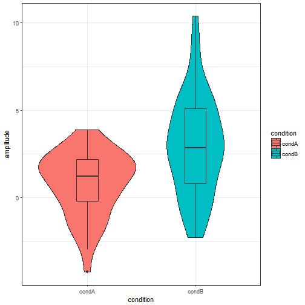
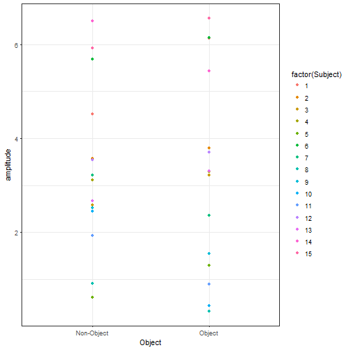

Analysing EEG data in R
========================================================
author: Matt Craddock
date: 19 June 2017
autosize: true

About R
===

1. Free, open source
2. Massive community


Why use R for EEG? 
===

RStudio
===

Integrated development environment!
- Package manager
- Projects
- Notebooks
- Github integration

Packages
===
R is extensible through *packages*.


R Basics
===

- Vectors
- Lists
- Data frames
- Functions

Vectors
===

Lists
===

Data frames
===


```r
library(tidyverse)
ObjFreqERPs <- read_csv("../data/ObjFreqERPs.csv")
ObjFreqERPs
```

```
# A tibble: 6,135 x 8
   `Object/BB` `Object/HSF` `Object/LSF` `Non-Object/LSF` `Non-Object/HSF`
         <dbl>        <dbl>        <dbl>            <dbl>            <dbl>
 1    0.195420     0.392420      0.23052          -1.1717          0.55332
 2    0.188040     0.280100      0.42763          -1.1999          0.65972
 3    0.171190     0.186090      0.65327          -1.2339          0.75703
 4    0.142760     0.118700      0.87669          -1.2761          0.82759
 5    0.103260     0.036484      1.03270          -1.3268          0.86519
 6    0.065559    -0.080596      1.10820          -1.3844          0.88463
 7    0.047670    -0.179570      1.14740          -1.4429          0.90511
 8    0.060566    -0.210520      1.17710          -1.4880          0.94317
 9    0.108420    -0.199480      1.18150          -1.5042          0.99105
10    0.179090    -0.203010      1.13920          -1.4903          1.02380
# ... with 6,125 more rows, and 3 more variables: `Non-Object/BB` <dbl>,
#   Time <dbl>, Subject <int>
```

Functions
===

```
mean <- function(x) {
  mean(x)
}
```
Get help on any function using ?function_name.

Assignment
===

Assign the ```<-``` operator.

e.g. 

```
x <- 1
y <- "hello"
z <- mean(x)
```
How to import data
===
From Matlab 
- .mat and .set files are HDF5 format.
- can be read directly
- a bit cumbersome, may be easier to convert to csv

From Python
- csv
- feather

The Tidyverse
===

Set of integrated packages
- ggplot2
- dplyr
- purr
- pipes


```r
library(tidyverse)
```

ggplot2
===

***


Piping %>%
===
Allows code to be read from left-to-right


```r
tmp_var <- iris
tmp_var$
```


```r
tmp_var <- iris %>%
  select(Petal.Length) 
```

Converting between wide and long format
===
Many statistics commands in R expect data to be *long* format - one observation per row.
spread() and gather() allow simple switching between formats.
tidyr

Summarizing data
===
1. Group data
2. Summarise data


Nested data frames
===
A useful concept from the tidyverse is the nested data frame. A column in a data frame can be a list, and a list can contain data frames. 


```r
nest(iris,-Species)
```

```
# A tibble: 3 x 2
     Species              data
      <fctr>            <list>
1     setosa <tibble [50 x 4]>
2 versicolor <tibble [50 x 4]>
3  virginica <tibble [50 x 4]>
```

How to select data
===

Mixed-effects modelling
===

Frequentist approach
- Linear mixed-effects models
-- lme4

Bayesian
- brms/rstanarm/Stan

lme4 syntax
===

* dv ~ fixed_effects + (random_slopes|random_effects)
* dv ~ iv1 + (1 + iv1|id)
* dv ~ iv1 + iv2 + iv1:iv2 + (iv1 + iv2 + iv1:iv2|id)
* dv ~ iv1*iv2 + (iv1*iv2|id)

Can have multiple random effects
* dv ~ iv1*iv2 + (iv1*iv2|Sub_id) + (iv1*iv2|object)

Mass Univariate Statistics
===


```r
library(purrr)
```

Hierarchical modelling
===

Machine learning
===

Caret


Exercises
===

1. Get help for commands using *?command*
2. Commands are indicated in the text in *italics* and followed by parentheses e.g. *command()*
3. Auto-complete is (mostly) your friend
4. Use the chunks! 

